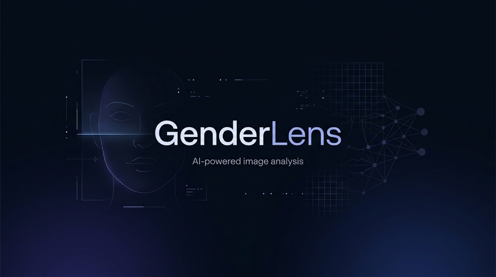

# GenderLens

<p align="center">
  
</p>


**GenderLens** is a demo application for gender classification from an image containing one or more faces. The application automatically detects faces in the image and predicts one of two categories for each detected face: **Male** or **Female**, together with the model's prediction score.

## Features

* Detection of one or more faces in an image
* Gender classification for each detected face
* Display of the prediction score
* Support for `.jpg`, `.jpeg`, and `.png` images
* Web interface built with Streamlit

## How It Works

The main processing pipeline is:

```text
Input Image
     ↓
Face Detection
     ↓
Face Cropping
     ↓
Preprocessing
     ↓
MobileNetV2 Model
     ↓
Prediction + Score
```

For face detection, the application uses the **OpenCV DNN Face Detector**, based on **SSD** and **ResNet-10**.

For classification, **MobileNetV2** with **Transfer Learning** is used. The model is trained to predict one of the two categories.

## Technologies

* **Python**
* **OpenCV**
* **TensorFlow / Keras**
* **MobileNetV2**
* **NumPy**
* **Scikit-learn**
* **Matplotlib**
* **Streamlit**

## Project Structure

```text
gender_recognition/
│
├── app.py
├── train.py
├── evaluate.py
├── preprocessing.py
├── crop_faces.py
├── requirements.txt
│
├── models/
│   ├── deploy.prototxt
│   ├── res10_300x300_ssd_iter_140000.caffemodel
│   └── gender_model.keras
│
├── dataset/
│   ├── prepare_dataset.py
│   ├── split_dataset.py
│   ├── train/
│   ├── validation/
│   └── test/
│
├── test_images/
└── cropped_faces/
```

## Dataset

The **UTKFace** dataset was used to train the classification model.

The dataset contains face images that were organized into two categories:

* `male`
* `female`

The data was divided into:

* **Train:** 18,963 images
* **Validation:** 2,370 images
* **Test:** 2,372 images

A total of **23,705 images** were used.

## Model

The classification model is based on **MobileNetV2** with **Transfer Learning**.

The pretrained MobileNetV2 base was kept frozen, and a custom classification head was added:

```text
MobileNetV2
     ↓
Global Average Pooling
     ↓
Dense (128)
     ↓
Dropout (0.3)
     ↓
Dense (1, Sigmoid)
```

Input images are resized to **224 × 224 pixels** and normalized by dividing pixel values by 255.

## Results

The model was evaluated on a test set containing **2,372 images**.

| Metric    |     Result |
| --------- | ---------: |
| Accuracy  | **85.08%** |
| Precision | **85.24%** |
| Recall    | **83.13%** |

The results show that the model performs the classification task on the test set, although individual predictions are not guaranteed to be correct.

## Running the Application

### 1. Install dependencies

```bash
pip install -r requirements.txt
```

### 2. Start the application

```bash
streamlit run app.py
```

Streamlit will then provide a local address where the application can be opened in a web browser.

## Requirements

The main libraries and versions are listed in `requirements.txt`.

```text
tensorflow==2.21.0
opencv-python==4.10.0.84
numpy
matplotlib
scikit-learn
streamlit
Pillow
```

## Limitations

The prediction can be affected by image quality and conditions such as lighting, face angle, partially covered faces, and differences between the dataset images and real-world images.

The prediction score represents the output of the model and **does not guarantee that the prediction is correct**.

## Future Improvements

* Expanding the dataset with a larger variety of images
* Fine-tuning MobileNetV2
* Improving face detection and cropping
* Performing a more detailed analysis of incorrect predictions
* Improving the user interface

## Author

**Veronika Ivanova**

FINKI — Faculty of Computer Science and Computer Engineering
